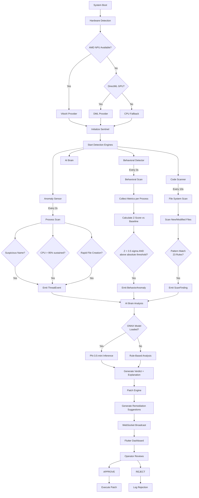
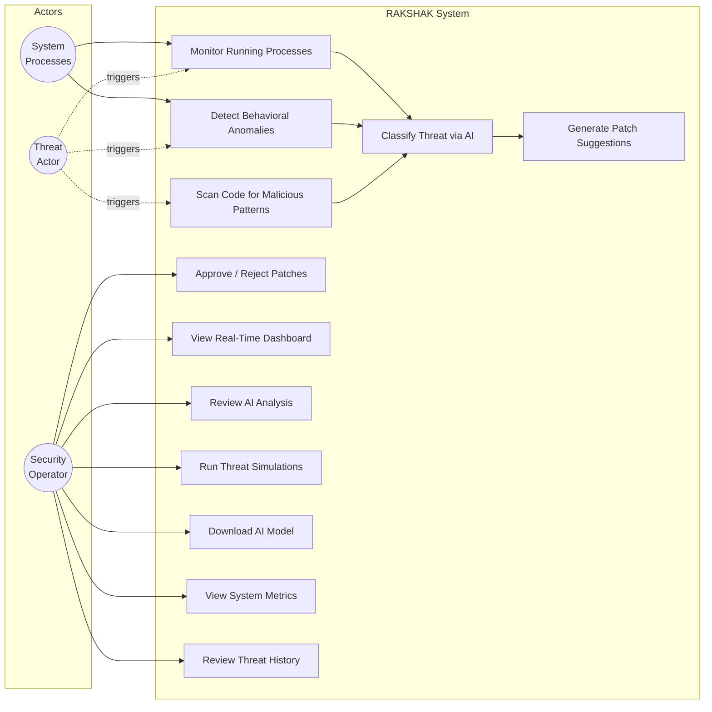
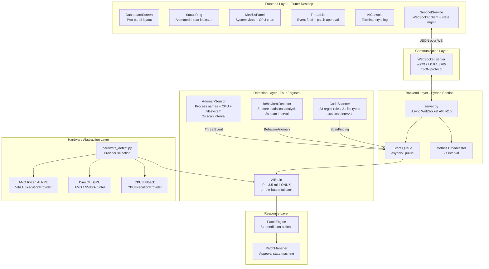

<div align="center">

# RAKSHAK

### AI-Powered Local-First Cybersecurity Solution

**Zero-day behavioral threat detection, on-device AI analysis, and human-approved auto-remediation — running entirely on your hardware. No cloud. No telemetry. Zero trust by design.**

Built for the [AMD Slingshot Hackathon 2026](https://amdslingshot.devpost.com/)

[](https://python.org)
[](https://flutter.dev)
[](https://onnxruntime.ai)
[](https://www.amd.com/en/products/software/ryzen-ai.html)
[](LICENSE)

</div>

---

## 1. Executive Summary

**RAKSHAK** (Sanskrit: *The Protector*) is a real-time endpoint defense system that detects, analyzes, and remediates cybersecurity threats entirely on-device. It combines signature-based detection, statistical behavioral analysis for zero-day threats, AI-powered threat classification via a quantized Phi-3.5-mini ONNX model, and an ethics-first auto-patch engine that requires human approval before any action is taken.

**Why it matters:** Traditional endpoint security depends on cloud lookups, vendor signature databases, and internet connectivity. RAKSHAK inverts this model. It learns what "normal" looks like for every process on your machine and flags statistical deviations in real-time — catching threats that have no existing signature. It runs on commodity hardware using AMD's NPU/GPU/CPU acceleration stack, making enterprise-grade behavioral detection accessible without cloud infrastructure costs.

**What makes it innovative:**
- **Zero-day detection without signatures** — z-score statistical analysis learns per-process baselines and flags anomalies
- **Fully local AI inference** — Phi-3.5-mini ONNX model runs on-device via DirectML, never sends data externally
- **Hardware-agnostic acceleration** — auto-detects AMD Ryzen AI NPU, any DirectML GPU (AMD/NVIDIA/Intel), or CPU fallback
- **Ethics-first remediation** — every suggested patch requires explicit human approval before execution
- **Four independent detection engines** working in parallel with coordinated threat response

---

## 2. Problem Statement

Modern cyberthreats are evolving faster than signature databases can update. According to the AV-TEST Institute, over **450,000 new malware variants** are registered daily. Traditional antivirus solutions face three critical failures:

| Problem | Impact |
|---------|--------|
| **Cloud dependency** | Offline machines are unprotected. Network latency delays detection by seconds to minutes. |
| **Signature lag** | Zero-day attacks exploit the window between discovery and signature distribution (avg. 7 days). |
| **Privacy erosion** | Endpoint telemetry is uploaded to vendor clouds, creating data sovereignty risks for sensitive environments. |
| **Alert fatigue** | High false-positive rates cause operators to ignore legitimate alerts. |
| **No remediation guidance** | Detections are reported but the operator must figure out the response manually. |

**The gap:** There is no widely available, local-first, AI-powered endpoint defense system that can detect zero-day behavioral anomalies, provide natural-language threat analysis, and suggest human-approved remediations — all running on commodity hardware without cloud infrastructure.

---

## 3. Proposed Solution

RAKSHAK is a two-component system:

1. **Python Sentinel Backend** — a multi-engine detection server that monitors all running processes, file system activity, and source code in real-time via four independent detection engines
2. **Flutter Desktop Dashboard** — a real-time command center connected over WebSocket that visualizes threats, system metrics, and provides one-click patch approval/rejection

The system operates on a **detect-analyze-suggest-approve** pipeline:

```
Process/File Event → Detection Engine → AI Analysis → Patch Suggestion → Human Approval → Execution
```

Every step is transparent. Every action requires consent. The AI explains its reasoning. The operator decides.

---

## 4. Features Offered by the Solution

### Core Detection Features
- **Real-time process monitoring** — scans all running processes every 2 seconds for suspicious names, sustained CPU abuse, and new process creation
- **Filesystem surveillance** — watches directories (default: TEMP) for rapid file creation bursts (ransomware indicator)
- **14 known-threat signatures** — mimikatz, cobalt strike, meterpreter, ransomware, reverse shells, keyloggers, cryptominers, and more
- **Sustained spike detection** — requires 2+ consecutive high-CPU scans before alerting, eliminating transient spikes

### Advanced AI Features
- **Zero-day behavioral detection** — z-score statistical analysis across 7 metrics (CPU, memory, disk I/O read/write, network connections, thread count, child process spawns) with no prior signatures required
- **On-device LLM inference** — Phi-3.5-mini-instruct ONNX (INT4 AWQ quantized, ~2.4 GB) generates natural-language threat explanations and severity classifications
- **Graceful AI degradation** — if the model is unavailable, falls back to rule-based analysis with keyword matching and heuristic scoring
- **Process tree forensics** — traces parent chains up to 5 levels to identify the origin of suspicious activity

### Security Features
- **23-rule code scanner** across 5 threat categories: reverse shells, credential leaks, obfuscation, exploit patterns, suspicious OS operations
- **31 file type coverage** — Python, JavaScript, PowerShell, Bash, C/C++, Go, Rust, Java, config files, logs, SQL, and more
- **Auto-patch engine** with 8 remediation actions: process termination, network blocking, file quarantine, secret redaction, directory lockdown, process tree suspension, I/O throttling, Defender scan
- **Human-in-the-loop ethics layer** — no automated action is ever taken without explicit operator approval

### User Experience Features
- **Animated status ring** — immediate visual threat indicator (SECURE / THREAT / OFFLINE) with glowing animated arcs
- **Real-time metrics dashboard** — CPU sparkline chart, RAM/disk progress bars, network TX/RX counters, process count
- **Defense engine telemetry** — live stats for behavioral scans, code scanner findings, and patch pipeline status
- **Color-coded threat feed** — events tagged by detection source (THREAT / BEHAVIOR / SCAN) with severity badges
- **AI console** — terminal-style log with syntax-colored output for system events, AI analysis, and patch actions
- **One-click patch approval** — inline APPROVE/REJECT buttons with risk level and reversibility indicators

---

## 5. Process Flow Diagram



---

## 6. Use-Case Diagram



---

## 7. Wireframes

### Main Dashboard Layout

```
+------------------------------------------------------------------+
| [*] RAKSHAK  [MVP]              [AMD GPU via DirectML] [ONLINE]  |
+------------------------------------------------------------------+
|                    |                                              |
|   +------------+  |  THREAT FEED                            [3]  |
|   |            |  |  +------------------------------------------+|
|   |  SECURE /  |  |  | CRITICAL  THREAT  mimikatz.exe   PID:481 ||
|   |  THREAT /  |  |  | Mimikatz-class credential harvesting     ||
|   |  OFFLINE   |  |  | > IMMEDIATELY terminate the process      ||
|   |   (ring)   |  |  +------------------------------------------+|
|   |            |  |  | HIGH  BEHAVIOR  svchost.exe      PID:772 ||
|   +------------+  |  | CPU usage jumped to 98.2% (baseline 2.1%)||
|                    |  | > Terminate the process                  ||
|   SYSTEM VITALS    |  +------------------------------------------+|
|   ~~~~~~~~~~~~~~   |  | MEDIUM  SCAN  config.py     line:42     ||
|   CPU  [====  ] 23%|  | Hardcoded password detected              ||
|   RAM  [======] 61%|  | > Remove secrets from source             ||
|   DISK [=======]72%|  +------------------------------------------+|
|   NET   TX 142 MB  |                                              |
|   PROCS      287   |  +--2 PATCHES AWAITING APPROVAL-------------+|
|                    |  | LOW  kill_process: mimikatz  [APPROVE]    ||
|   DEFENSE ENGINES  |  | LOW  defender_scan: C:\     [REJECT]     ||
|   ~~~~~~~~~~~~~~~  |  +------------------------------------------+|
|   Behavioral       |                                              |
|    142 scans | 3   |  AI CONSOLE                          [LIVE] |
|   Scanner          |  +------------------------------------------+|
|    89 files | 1    |  | [09:41:02] [SYS] Connected to Rakshak v2 ||
|   Patches          |  | [09:41:02] [HW]  Device: GPU (AMD)       ||
|    5 sugg | 2 app  |  | [09:41:15] [THREAT] CRITICAL | mimikatz  ||
|                    |  | [09:41:15] [AI] Mimikatz-class credential ||
|   UPTIME  4m 32s   |  | [09:41:15] [PATCH] PATCH-0001 | kill...  ||
|                    |  +------------------------------------------+|
+------------------------------------------------------------------+
```

### Threat Detail View (Expanded Card)

```
+------------------------------------------------------+
| CRITICAL   THREAT   mimikatz.exe           PID: 4812 |
|                                          rule-based   |
|------------------------------------------------------|
| Mimikatz-class credential harvesting tool detected.   |
| Capable of extracting plaintext passwords from        |
| memory. This is a known post-exploitation tool used   |
| in advanced persistent threats.                       |
|                                                       |
| > IMMEDIATELY terminate the process and isolate the   |
|   host from the network.                              |
+------------------------------------------------------+
```

### Patch Approval Banner

```
+------------------------------------------------------+
| [!] 2 PATCHES AWAITING APPROVAL      Human Required  |
|------------------------------------------------------|
| MEDIUM  kill_process: mimikatz.exe (PID 4812)        |
|         [undo] [APPROVE] [REJECT]                    |
|                                                       |
| LOW     defender_scan: C:\                            |
|               [APPROVE] [REJECT]                     |
+------------------------------------------------------+
```

---

## 8. Architecture Diagram



---

## 9. Technologies Used

| Layer | Technology | Purpose |
|-------|-----------|---------|
| **Frontend** | Flutter 3.3+ (Dart) | Cross-platform desktop dashboard |
| | Provider (ChangeNotifier) | Reactive state management |
| | fl_chart | Real-time CPU sparkline charts |
| | google_fonts (JetBrains Mono) | Monospace terminal aesthetic |
| | web_socket_channel | WebSocket client library |
| **Backend** | Python 3.12 | Asynchronous detection server |
| | websockets (v12+) | WebSocket API server |
| | psutil | Process monitoring, system metrics |
| | asyncio | Concurrent event broadcasting |
| | threading | Background detection loops |
| **AI / ML** | Phi-3.5-mini-instruct ONNX | On-device threat classification LLM |
| | onnxruntime-genai-directml | Autoregressive text generation |
| | onnxruntime-directml | GPU-accelerated ONNX inference |
| | INT4 AWQ quantization | 75% model size reduction (10GB to 2.4GB) |
| **Hardware** | AMD Ryzen AI NPU (XDNA/AIE) | Lowest-power AI inference |
| | DirectML | Vendor-agnostic GPU acceleration |
| | VitisAI EP | AMD NPU execution provider |
| | WMI / PowerShell CIM | Hardware enumeration |
| **Security** | 23 compiled regex rules | Code pattern scanning |
| | z-score statistical engine | Behavioral anomaly detection |
| | Rule-based threat KB | 14 known-malware signature rules |
| | Human-in-the-loop approval | Ethics-first patch execution |

---

## 10. Project Structure

```
rakshak/
├── sentinel/                           # Python Backend (Detection Server)
│   ├── server.py                       #   WebSocket API server v2.0.0-mvp
│   ├── anomaly_sensor.py               #   Process + filesystem monitoring
│   ├── behavioral_detector.py          #   Z-score behavioral analysis engine
│   ├── code_scanner.py                 #   23-rule pattern scanner
│   ├── ai_brain.py                     #   Phi-3.5-mini ONNX inference + fallback
│   ├── patch_engine.py                 #   Auto-remediation suggestion engine
│   ├── hardware_detect.py              #   NPU / GPU / CPU detection
│   ├── mock_threat.py                  #   5-scenario threat simulator
│   ├── download_model.py              #   HuggingFace model downloader
│   └── models/phi3.5-mini/             #   ONNX model directory (downloaded)
│
├── flutter_dashboard/                  # Flutter Desktop Dashboard
│   ├── lib/
│   │   ├── main.dart                   #   App entry + theme configuration
│   │   ├── services/
│   │   │   └── sentinel_service.dart   #   WebSocket client + state management
│   │   └── widgets/
│   │       ├── dashboard_screen.dart   #   Two-panel layout + top bar
│   │       ├── threat_list.dart        #   Threat feed + patch approval UI
│   │       ├── metrics_panel.dart      #   System vitals + defense engine stats
│   │       ├── status_ring.dart        #   Animated threat level indicator
│   │       └── ai_console.dart         #   Terminal-style event log
│   ├── windows/                        #   Native Windows runner (CMake)
│   ├── pubspec.yaml                    #   Flutter dependencies
│   └── test/widget_test.dart           #   Smoke test
│
├── pyproject.toml                      # Python project config
├── requirements.txt                    # Python dependencies
└── README.md
```

---

## 11. Quick Start

### Prerequisites

| Requirement | Version | Notes |
|-------------|---------|-------|
| Python | 3.12+ | Backend runtime |
| Flutter | 3.3+ | Dashboard build |
| Windows | 10/11 | Required for DirectML, psutil process APIs |
| GPU (optional) | Any DirectML-compatible | AMD, NVIDIA, or Intel for accelerated inference |

### Step 1: Install Python Dependencies

```bash
pip install -r requirements.txt
```

### Step 2: Start the Sentinel Backend

```bash
python -m sentinel.server
```

```
========================================================
   RAKSHAK v2.0 - AI Cybersecurity Sentinel
   Local-First | Behavioral AI | Zero-Day Detection
========================================================
[INFO] Hardware: GPU (AMD) via DirectML
[INFO] AI Engine: rule-based (model not downloaded)
[INFO] Features: behavioral, code_scanner, patch_engine, ethics_layer
[INFO] WebSocket server listening on ws://127.0.0.1:8765
```

### Step 3: Launch the Flutter Dashboard

```bash
cd flutter_dashboard
flutter run -d windows
```

### Step 4 (Optional): Download AI Model

```bash
pip install onnxruntime-genai-directml huggingface-hub
python -m sentinel.download_model
```

Downloads Phi-3.5-mini-instruct ONNX (~2.4 GB, INT4 AWQ quantized). System works without it using rule-based + behavioral engines.

### Step 5 (Optional): Run Threat Simulations

```bash
python -m sentinel.mock_threat                    # All 5 scenarios
python -m sentinel.mock_threat --scenario cpu      # Single scenario
python -m sentinel.mock_threat --no-cleanup        # Keep artifacts for forensics
```

| Scenario | Target Engine | What It Does |
|----------|---------------|-------------|
| `process` | Anomaly Sensor | Spawns `fake_malware_dropper.py` |
| `files` | Anomaly Sensor | Creates 50 `.locked` files in TEMP |
| `cpu` | Behavioral Detector | Runs tight loop as `cryptominer_sim.py` for 25s |
| `code` | Code Scanner | Drops 4 files: reverse shell, leaked creds, encoded PowerShell, shadow copy wiper |
| `network` | Behavioral Detector | Opens 30 socket connections to localhost |

---

## 12. Detection Engine Deep Dive

### Anomaly Sensor (Signature + Heuristic)

| Parameter | Value | Rationale |
|-----------|-------|-----------|
| Scan interval | 2.0s | Balance between responsiveness and CPU overhead |
| CPU spike threshold | 95% | Raised from 85% — compilers and browsers routinely exceed 85% |
| Sustained count | 2 consecutive | Eliminates transient spikes from legitimate workloads |
| Rapid file creation | 20 files/window | Catches ransomware encryption bursts |
| Alert cooldown | 60 seconds | Prevents alert storms from the same process |
| Trusted process whitelist | 50+ entries | NVIDIA, AMD, Chrome, VS Code, Discord, Windows system processes |

### Behavioral Detector (Zero-Day, Signature-Free)

Statistical z-score analysis across 7 per-process metrics:

| Metric | Z-Score Threshold | Min Absolute | What It Catches |
|--------|-------------------|--------------|-----------------|
| CPU % | 3.5 sigma | > 15% | Cryptojacking, infinite loops |
| Memory % | 3.5 sigma | > 10% | Heap spray, data staging |
| Disk Write (MB) | 3.5 sigma | > 50 MB | Ransomware, log wiping |
| Disk Read (MB) | 3.5 sigma | > 50 MB | Data harvesting, DB exfiltration |
| Network Connections | 3.5 sigma | > 10 | C2 beacons, port scanning |
| Thread Count | 3.5 sigma | > 50 | Fork bombs, DLL injection |
| Child Spawns | Flat: 8 | N/A | Worm propagation, exploit frameworks |

**False positive elimination:**

| Technique | Implementation |
|-----------|---------------|
| Warmup phase | First 3 scans (9s) collect baseline silently — no alerts |
| Minimum samples | 10 data points required before flagging anomalies |
| Absolute thresholds | Z-score alone insufficient — observed value must exceed minimum |
| Per-process cooldown | 120s between consecutive alerts for same (PID, anomaly_type) |
| Process whitelist | 50+ trusted system, GPU, browser, dev, and communication processes |

### Code Scanner (23 Rules, 5 Categories)

| Category | # Rules | Severity | Examples |
|----------|---------|----------|----------|
| **Reverse Shells** | 4 | CRITICAL | Python `socket.connect`, bash `/dev/tcp`, netcat `-e`, PowerShell `TCPClient` |
| **Credential Leaks** | 4 | HIGH-CRITICAL | Hardcoded passwords, API keys, AWS `AKIA*` keys, PEM private keys |
| **Obfuscation** | 4 | HIGH | `exec(base64.b64decode(...))`, PowerShell `-EncodedCommand`, hex shellcode |
| **Exploit Patterns** | 4 | MEDIUM-CRITICAL | SQL injection `UNION SELECT`, XSS `<script>`, path traversal `../../../`, `rm -rf` |
| **Suspicious OS Ops** | 7 | MEDIUM-CRITICAL | Disable Defender, disable firewall, registry Run key persistence, `vssadmin delete shadows` |

**Coverage:** 31 file extensions. Max file size: 1 MB. Skips `node_modules`, `__pycache__`, `.git`, `venv`, `build`, `dist`.

### AI Brain (Phi-3.5-mini ONNX)

| Parameter | Value |
|-----------|-------|
| Model | microsoft/Phi-3.5-mini-instruct-onnx |
| Quantization | INT4 AWQ block-128 |
| Size | ~2.4 GB |
| Max output tokens | 256 |
| Temperature | 0.3 |
| Top-p | 0.9 |
| Inference tracking | Per-call latency, cumulative stats |

**Fallback chain:** Phi-3.5-mini ONNX (best) -> Rule-based keyword engine (always available)

---

## 13. Estimated Implementation Cost

| Component | Estimated Cost (USD) | Notes |
|-----------|---------------------|-------|
| **Development** | | |
| Python backend (4 detection engines) | $3,000 - $5,000 | ~2,000 lines, 10 modules |
| Flutter dashboard | $2,000 - $3,500 | 6 widgets, WebSocket integration, real-time state |
| AI integration + model pipeline | $1,500 - $2,500 | ONNX Runtime setup, prompt engineering, fallback logic |
| Testing + threat simulator | $500 - $1,000 | 5 attack scenarios, integration testing |
| **Subtotal (Development)** | **$7,000 - $12,000** | Small team (2-3 devs) |
| | | |
| **Infrastructure** | | |
| Cloud hosting | $0 / month | Fully local — no cloud required |
| AI model storage | $0 | Model downloaded once from HuggingFace (free) |
| GPU hardware | $0 - $300 | Uses existing AMD/NVIDIA/Intel GPU; CPU works too |
| | | |
| **Ongoing Maintenance** | | |
| Rule database updates | $200 - $500 / month | New scan rules, signature updates |
| Model fine-tuning | $0 - $100 / month | Optional: fine-tune on org-specific threat data |
| Bug fixes + patching | $300 - $500 / month | Standard maintenance |
| **Subtotal (Monthly)** | **$500 - $1,100 / month** | |
| | | |
| **Total Year-1 Cost** | **$13,000 - $25,200** | Development + 12 months maintenance |

> **Key advantage:** $0 cloud cost. No per-endpoint licensing. No data egress fees. The entire system runs on hardware the organization already owns.

---

## 14. Scalability & Future Scope

### How the System Scales

| Dimension | Current (MVP) | Future Scale |
|-----------|---------------|-------------|
| Endpoints | Single machine | Fleet deployment via central management server |
| Detection rules | 23 code scan + 14 signature | Community-contributed rule packs (YARA integration) |
| AI model | Phi-3.5-mini (3.8B params) | Fine-tuned domain-specific models, model distillation |
| Process monitoring | ~300 processes/scan | Kernel-level ETW (Event Tracing for Windows) integration |
| Platform | Windows 10/11 | Linux (eBPF), macOS (Endpoint Security Framework) |

### Roadmap

**Phase 2 — Enterprise Features**
- Central fleet management dashboard (multi-endpoint)
- SIEM integration (Splunk, Elastic, Sentinel)
- Active Directory / SSO authentication for patch approval
- Encrypted WebSocket (wss://) with TLS mutual auth

**Phase 3 — Advanced AI**
- Fine-tune Phi-3.5-mini on organization-specific threat telemetry
- Multi-model ensemble (behavioral model + code analysis model + NLP model)
- Federated learning across endpoints without sharing raw data
- AMD Ryzen AI NPU-optimized model quantization (INT4 → INT2)

**Phase 4 — Platform Expansion**
- Linux agent using eBPF for kernel-level process monitoring
- macOS agent using Endpoint Security Framework
- ARM64 support for edge/IoT deployment
- Container/Kubernetes workload monitoring

---

## 15. Why This Solution Wins

### Innovation

RAKSHAK combines four techniques that are individually well-known but rarely integrated into a single, local-first system:

1. **Statistical behavioral detection** (z-score) — used in network IDS but rarely applied at the per-process level on endpoints
2. **On-device LLM inference** — commercial EDR products use cloud AI; RAKSHAK runs Phi-3.5-mini locally via DirectML
3. **Hardware-agnostic NPU/GPU/CPU cascade** — automatically selects the best available accelerator without configuration
4. **Ethics-first auto-remediation** — AI suggests, human decides; every patch is tracked, auditable, and reversible

### Feasibility

This is not a concept. It is a working system:
- Backend and dashboard build and run on Windows 10/11
- All 4 detection engines operate concurrently in production
- 5 realistic attack simulations validate detection coverage
- AI model downloads from HuggingFace and runs inference on commodity GPUs
- False positive rate reduced to near-zero through warmup, cooldowns, absolute thresholds, and whitelists

### Real-World Impact

| Metric | Value |
|--------|-------|
| Detection latency | 2-3 seconds (anomaly sensor) to 10 seconds (code scanner) |
| Zero-day capability | Yes — behavioral z-score requires no prior signatures |
| Privacy | 100% local — no data leaves the machine |
| Cost per endpoint | $0 (runs on existing hardware) |
| Operator overhead | Minimal — AI explains threats, suggests patches, operator clicks approve/reject |

### Differentiation from Existing Solutions

| Feature | CrowdStrike / SentinelOne | Windows Defender | RAKSHAK |
|---------|--------------------------|-----------------|---------|
| Cloud dependency | Required | Partial | None |
| Zero-day behavioral | Cloud ML | Heuristic only | Local z-score + LLM |
| AI threat explanation | No | No | Yes (Phi-3.5-mini) |
| Auto-remediation | Automated (no consent) | Automated | Human-approved |
| NPU acceleration | No | No | Yes (Ryzen AI) |
| Cost | $15-25/endpoint/month | Free (basic) | $0 |
| Data sovereignty | Vendor cloud | Microsoft cloud | 100% local |
| Open architecture | Proprietary | Proprietary | Open source |

---

<div align="center">

**RAKSHAK** — *The Protector*

Local-First. AI-Powered. Human-Approved.

Built with AMD hardware acceleration for the [Slingshot Hackathon 2026](https://amdslingshot.devpost.com/)

</div>
